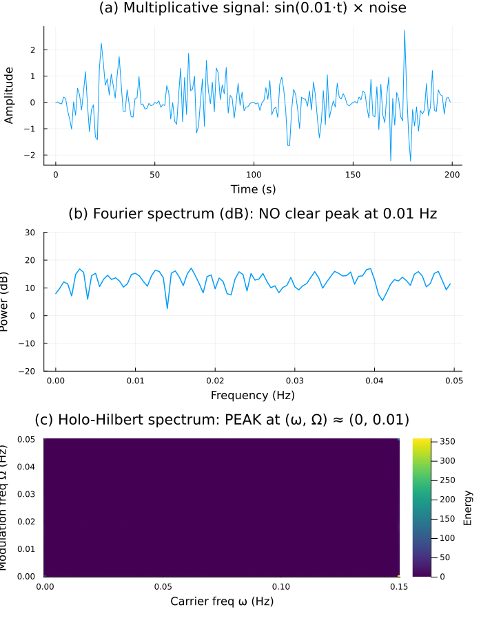

# HHSA.jl — Holo-Hilbert Spectral Analysis

**Why you need this:** Fourier analysis cannot detect *multiplicative* interactions in signals. When a slow modulation *multiplies* a carrier (not adds), classical spectrograms show only noise. **HHSA reveals the hidden modulation.**

## The Problem: Fourier Fails on Multiplicative Signals

Consider a signal where noise is *modulated by* a slow sine wave:

$$x(t) = \sin(2\pi f_m t) \times \text{noise}(t)$$

This is **multiplicative** (product), not additive (sum). The Fourier spectrum averages over time and shows only a flat noise floor — the 0.01 Hz modulation is invisible.

HHSA, however, applies the **Hilbert transform to the EMD amplitude envelope** (the "holo" step), revealing the modulation frequency that Fourier misses:



> **Figure:** Paper's central result (Huang et al. 2016). Panel (b): classical Fourier spectrum shows no clear peak. Panel (c): HHSA holo-spectrum reveals the hidden 0.01 Hz modulation via a peak in the (carrier frequency × modulation frequency) space.

## What is HHSA?

**Holo-Hilbert Spectral Analysis** extends the classical Hilbert-Huang Transform with a second layer:

1. **Stage 1 (Standard HHT):**
   - Decompose signal into Intrinsic Mode Functions (IMFs) via Empirical Mode Decomposition.
   - Extract **instantaneous amplitude** $A_j(t)$ and **carrier frequency** $\omega_j(t)$ via Hilbert transform.

2. **Stage 2 (The "Holo" Step):**
   - Decompose each amplitude envelope $A_j(t)$ again via EMD.
   - Extract **modulation frequency** $\Omega_{j,k}(t)$ from the second-layer IMFs.

3. **Result:**
   - A 2-D **holo-spectrum** showing energy density in **(carrier frequency ω × modulation frequency Ω)** space, not just (time × frequency).

### Mathematical Summary

Each Stage-1 IMF $c_j(t)$ is converted to an analytic signal via the Hilbert transform:

$$z_j(t) = c_j(t) + i \mathcal{H}[c_j(t)] = A_j(t) e^{i\phi_j(t)}$$

The amplitude envelope $A_j(t)$ then undergoes EMD to reveal modulation:

$$A_j(t) = \sum_k IA_{j,k}(t) + r_j(t)$$

where $IA_{j,k}$ are modulation IMFs. Applying the Hilbert transform again yields $\Omega_{j,k}(t)$.

The **holo-spectrum** is the 2-D energy map:

$$H(\omega, \Omega) = \sum_{j,k} \int A_{j,k}^2(t) \, \delta(\omega - \omega_j(t)) \, \delta(\Omega - \Omega_{j,k}(t)) \, dt$$

For a detailed treatment, see **Huang et al. (2016)** *"On Holo-Hilbert spectral analysis: a full informational spectral representation for nonlinear and non-stationary data,"* Phil. Trans. R. Soc. A **374**, 20150196. ([doi:10.1098/rsta.2015.0196](https://doi.org/10.1098/rsta.2015.0196))

## Features

- **Pure Julia EMD** — natural cubic spline envelopes, mirror boundary handling (Rilling et al. 2003), SD stopping criterion.
- **Minimal dependencies** — only `DSP.jl` (Hilbert transform) and `Plots.jl` (visualization). No legacy packages, no SPM12.
- **Two-layer HHSA pipeline** — automatically extracts both carrier and modulation frequencies.
- **Reproducible** — tested against the paper's own synthetic examples.

## Installation

### Requirements
- Julia 1.6 or later (tested with 1.12)

### Quick Setup

```bash
cd /path/to/HHSA_Julia
julia --project=.
```

From the Julia REPL:

```julia
using Pkg
Pkg.instantiate()   # Install DSP.jl and Plots.jl
```

## Usage

### Interactive Notebook Demo

For an interactive walkthrough that reproduces all three cases (additive, multiplicative, two-carrier AM), open:

```bash
cd notebooks
jupyter notebook hhsa_paper_demo.ipynb
```

Or view it directly on GitHub for a quick visual tutorial.

### Basic Example

```julia
using HHSA

# Your signal: 1D Float64 vector, sampling rate fs in Hz
x = your_signal_vector  
fs = 1000.0              # Hz

# Run HHSA
result = hhsa(x, fs; max_imfs=8, max_sift=200, sd_threshold=0.1)

# Visualize
plot_imfs(result)                    # Stage-1 IMF decomposition
plot_hilbert_spectrum(result)        # Time × carrier frequency
plot_holo_spectrum(result)           # Carrier frequency × modulation frequency
```

### Run the Demo

```bash
julia --project=. examples/demo.jl
```

This generates synthetic AM signals and produces four PNGs in `output/`:

- `01_signal.png` — raw input
- `02_stage1_imfs.png` — EMD decomposition
- `03_hilbert_spectrum.png` — classical time-frequency map
- `04_holo_spectrum.png` — the holo-spectrum (ω × Ω)

### Reproduce the Paper's Test

```bash
julia --project=. examples/paper_test_multiplicative.jl
```

This reproduces **Figure 2b** from Huang et al. (2016), demonstrating that HHSA reveals a 0.01 Hz modulation that Fourier analysis completely misses.

## API Reference

### Main Functions

**`emd(signal; max_imfs=10, max_sift=200, sd_threshold=0.1)`**

Empirical Mode Decomposition. Returns a vector of IMFs (last element is the residue).

- `max_imfs`: Maximum number of IMFs to extract.
- `max_sift`: Maximum iterations per sifting loop.
- `sd_threshold`: Stopping criterion (normalized SD); lower = more iterations.

**`hhsa(signal, fs; emd_kw...)`**

Two-layer Holo-Hilbert Spectral Analysis. Returns a `HoloResult` struct containing:

- `imfs`, `carrier_amp`, `carrier_freq` — Stage 1 results
- `mod_imfs`, `mod_amp`, `mod_freq` — Stage 2 results
- `fs` — sampling rate

**`plot_imfs(result)`**

Stacked plot of Stage-1 IMFs and residue.

**`plot_hilbert_spectrum(result; n_freq=200, f_max=fs/2)`**

Time × carrier frequency heatmap (classical Hilbert spectrum).

**`plot_holo_spectrum(result; n_carrier=200, n_mod=100, ...)`**

Carrier frequency × modulation frequency heatmap (the holo-spectrum).

**`holo_spectrum(result; ...)`**

Compute the binned 2-D energy matrix directly (without plotting).

## Files

- `src/emd.jl` — EMD implementation (sifting, splines, extrema detection)
- `src/holo_spectrum.jl` — Hilbert analysis, two-layer HHSA, plotting functions
- `src/HHSA.jl` — module entry point
- `examples/demo.jl` — synthetic AM signal demo
- `examples/paper_test_multiplicative.jl` — reproduce paper Figure 2b
- `test/runtests.jl` — unit tests

## Notes & Caveats

- **Performance:** This implementation prioritizes clarity and transparency over optimization. For very large signals (>100k samples), consider parallelizing the inner EMD loop or using compiled spline libraries.
- **Parameter tuning:** EMD is sensitive to `sd_threshold` and `max_sift`. Lower `sd_threshold` extracts finer modes but increases computation. Adjust for your data.
- **End effects:** The code uses mirror boundary reflection to reduce boundary artifacts. For periodic signals, consider wrapping or extending the signal before analysis.
- **Bin resolution:** The holo-spectrum is computed on a fixed 2-D grid. Adjust `n_carrier`, `n_mod`, `f_carrier_max`, `f_mod_max` to match your frequency scales of interest.

## Reference

**Original paper & foundational works:**

- Huang, N. E., Shen, Z., Long, S. R., Wu, M. C., Shih, H. H., Zheng, Q., Yen, N.-C., Tung, C. C., & Liu, H. H. (1998).
  *The empirical mode decomposition and the Hilbert spectrum for nonlinear and non-stationary time series analysis.* 
  Proc. R. Soc. Lond. A **454**(1971), 903–935.

- Huang, N. E., Hu, K., Yang, A. C. C., Chang, H.-C., Jia, D., Liang, W.-K., Yeh, J.-R., Kao, C.-L., & Liu, C. (2016).
  *On Holo-Hilbert spectral analysis: a full informational spectral representation for nonlinear and non-stationary data.*
  Phil. Trans. R. Soc. A **374**, 20150196. ([link](https://doi.org/10.1098/rsta.2015.0196))

- Rilling, G., Flandrin, P., & Gonçalves, P. (2003).
  *On empirical mode decomposition and its algorithms.* 
  IEEE-EURASIP Workshop on Nonlinear Signal and Image Processing (NSIP-03).

## License

MIT License. See [LICENSE](LICENSE).

## Contributing & Future Work

- **EEMD (Ensemble EMD)** — planned for v0.2 (noise-assisted decomposition to reduce mode mixing).
- **Makie.jl backend** — optional interactive 3-D holo-spectrum visualization.
- **Interpolations.jl** — optional replacement for hand-rolled cubic splines (reduces code, negligible performance gain).
- **Porting your own data?** See `examples/demo.jl` for the workflow. Open an issue if you encounter edge cases.

## Contact

For questions, bug reports, or feature requests, please open an issue on GitHub or reach out to the maintainers.
